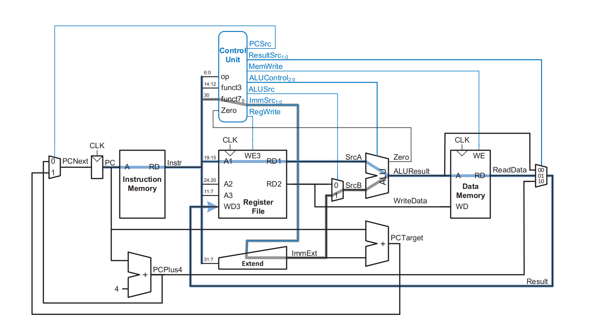
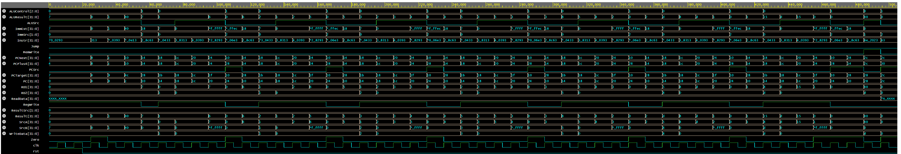

# RV32I Single-Cycle Processor Core

A 32-bit RISC-V processor core implemented in SystemVerilog. This project implements the full RV32I base integer instruction set and was successfully tested by running assembly programs (like the Fibonacci sequence) on actual hardware.

The design was functionally verified using Aldec Riviera-Pro and physically implemented on an FPGA using a custom terminal-based Vivado Tcl flow (no GUI).

## Architecture Overview

The processor uses a single-cycle microarchitecture with separate Instruction and Data memories.

- **Control Logic**: Hardwired main decoder and ALU decoder
- **Execution Unit**: Custom ALU that supports `ADD`, `SUB`, `AND`, `OR`, and `SLT`
- **Branching**: Full support for `BEQ` and `JAL` with correct target address calculation



## Implementation & Performance Metrics

The core was synthesized and implemented on a **Zynq-7000 (xc7z020)** FPGA.

- **Target Clock Frequency**: 100 MHz (10ns period)
- **Resource Utilization**:
  - LUTs: ~419 (LUT4: 116, LUT5: 209, LUT6: 94)
  - Registers (Flip-Flops): 201
  - CARRY4 blocks: 36

- **Timing Results**:
  - WNS (Worst Negative Slack): -0.804ns
  - TNS (Total Negative Slack): -11.437ns

> **Note**: The current critical path is a bit over the 10ns constraint. For now, the clock will be reduced to 90 MHz (11.1ns period) to meet timing. This will be improved in future versions by adding pipelining.

## Toolchain Workflow

I used two separate flows for verification and hardware implementation.

### 1. Functional Verification (Simulation)

Simulation and debugging were done using **Aldec Riviera-Pro** on EDA Playground.

- The `program.hex` file (machine code) was loaded directly into the instruction memory.
- I verified the Fibonacci program by observing cycle-by-cycle behavior in the EPWave waveform viewer, checking register updates and branch behavior.



### 2. Physical Implementation (Vivado - Terminal Only)

The physical hardware generation flow was fully automated using a custom Tcl script (`build.tcl`) executed in Vivado Batch Mode.

The script reads the timing and pin constraints from `clock.xdc`, synthesizes the RTL design, performs Place & Route, and generates the final implementation reports used for timing and resource analysis.

```bash
# Run the complete implementation flow
vivado -mode batch -source scripts/build.tcl